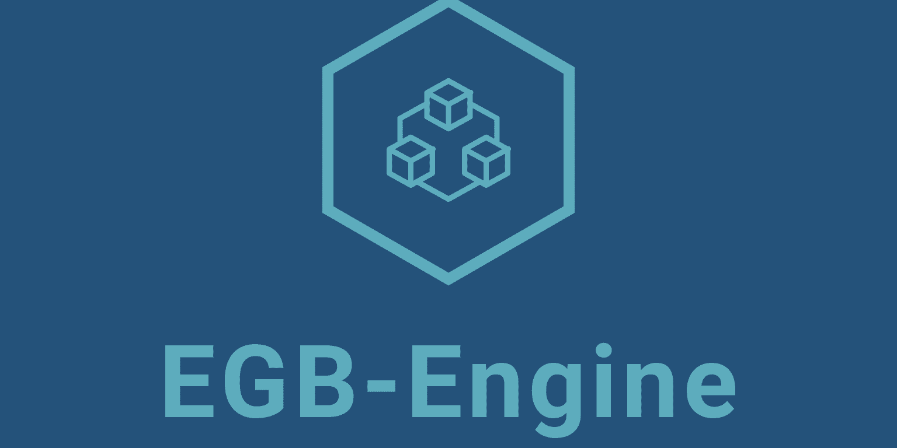

# EGB-Engine
A Game Engine For Humans!

# Quick Links

## By Continuing You Agree To My [EULA](https://github.com/ElhamAryanpur/EGB-Engine/blob/master/LICENSE.md)

[Docs](https://elhamaryanpur.github.io/EGB-Engine/)

[Progress](https://github.com/users/ElhamAryanpur/projects/1)

# About

This is a game engine that is web based and builds desktop and mobile games with ELang programming language and JavaScript. Currently coming with IDE and under development for some time. New updates will be commited every day. Let me know if you want to contribute! It really helps ;)

The original idea for this project was and is to build a game engine for [Royal Studios](https://discord.gg/g63g9zJ)!

# Technology
This engine uses WebGL at core. if WebGL was not supported, it will automatically use Canvas. The editor is made with python. The target platforms are any platform that can render HTML file. Other techs used will be in the lib directory.

I know the core of the engine is updated regularly, but for the sake of EGB-Engine, I'll go with only one version and then bring new features with new updates.

# Give a star for motivational support ;)

# Thank you! Contact me if need any help, suggestion, ...
[Facebook](https://www.facebook.com/elham.aryanpur.10) or [Instagram](https://www.instagram.com/elham_aryanpur)

# UPDATES AND FUTURE PLANS

check out [Progress](https://github.com/users/ElhamAryanpur/projects/1)!
